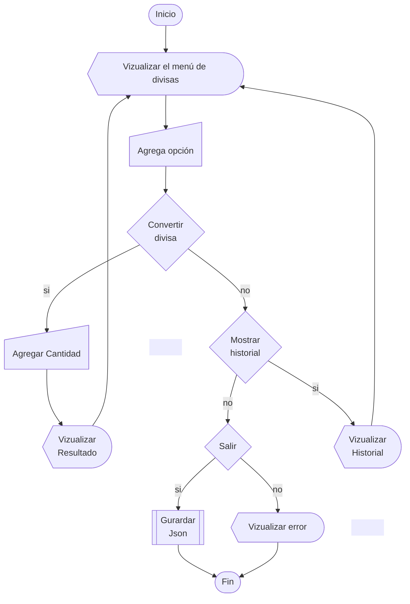

<h1 align = "center">Challenge Convertidor de Modeda </h1>

<div align = "center">


</div>

# Indice

*   [Descripción](#Descripción)

*   [Configuración Previa](#configuración-previa)

*   [Funcionalidad](#Funcionalidad)

*   [Acceso del Proyecto](#Acceso-del-Proyecto)

*   [Apoyos y Herramientas](#Apoyos-y-Herramientas)

*   [Diagrama de Flujo](#Diagrama-de-Flujo)

*   [Desarrollador](#Desarrollador)

<br>

# Descripción
<p align = "justify">
   Este Challenge forma parte del curso Alura Latam del grupo G8. Consiste en crear una aplicación que convierta diferentes divisas, extrayendo las Tasas de Conversión de Moneda desde una API.

# Configuración Previa
<p>
Se rquiere realizar unos ajustes previos (si se requieren) para que funcione correctamente la aplicación. Dichos ajustes se confingurarán en la clase <b>Principal</b>.
</p>

### Agregar divisas
<p align = "justify">   
En la clase Principal.java, se tiene el objeto "menu", se encarga de generar el menú de divisas; pero antes se definen las divisas a mostrar en el menú y la divisa principal que se encargará ser el cambio en todas las opciones generadas.
</b>
<br>
Un ejemplo es:
    
```Java
    menu.agregarDivisa("USD", "Dólar");
    menu.agregarDivisa("JPY", "Yen");
    menu.agregarDivisa("BRL", "Real");
    menu.agregarDivisa("MXN", "Peso Mexicano");
```
<p align = "justify">
Se observa, dos parámetros en el método 'agregarDivisa' :
* <b>divisa: </b>  hace referencia al código ISO de la divisa. Como el <i><u>peso mexicano</u></i> es <i><u>MXN</u></i>.
* <b>nombreDivisa</b>: hace referencia el nombre largo de la divisa. Como <i><u>dólar canadiense</i></u>, <i><u>dólar estaudense</i></u>, porque hay muchos tipos.
<br><br>

<b>Nota: </b>Es importante que esté bien la <i>divisa (parámetro)</i> para que funcione correctamente la aplicación.
</p>

### Divisa Principal
<p align = "justify"> 
La divisa principal se encargará de ser el cambio de moneda común en todas las opciones del menú. Al igual en "Agregar Divisas", se define desde el objeto menu con el método <b>setDivisaPrincipal(divisa)</b>.
</p>


```Java
menu.setDivisaPrincipal("USD");
```
<p align = "justify">
Se observa, el único parámetro es divisa, se debe a la nesesidad de colocar la divisa principal al menu con el método <b>agregarDivisa</b> también, donde se define el nombre de la divisa.
</p>

# Funcionalidad
<p>
Al ejecutar la aplicación se muestra el menú sobre las opciones de conversión, historial y salir de la aplicación.
</p>
Como se muestra en la siguiente imagen.
-------------Imagen Menu--------------------

### Mostrar el resultado
<p>
Una vez que se haya elgindo una opción y la cantidad a convertir, se mostrará la cantidad original con su divisa largo (nnombreDivisa) y la cantidad convertida con su nombre largo.
</p>
Como se muestra a continuación:  
--------------Imagen Resultado----------

### Mostrar historial
<p>
Al elegir la opción historial, se desplegará el listado almacendo con un formato: numeral, fecha, Hora, y la conversión en formato corto.
</p>
Como en la siguiente imagen:

------imagen historial----------

<p align = "justify">
<b>Nota importante:</b> La actualización del historial es posible al guardar los datos en un archivo json. Este archivo se encuentra como <b>"Notas.jason"</b>, y se amplia en cada conversión.
<br>
<i>Si se requiere <b>eleminar el historial</b>, se tiene que <b>borrar</b> el archivo de manera <b>manual</b>.</i>
</p>

# Acceso del Proyecto


# Apoyos y Herramientas
Se utilizaron como herramietas:
*   <b>Leguaje Java</b>: como principal leguaje de programación para este proyecto.
*   <b>Exchange Rate API</b>: Brinda la actugit alización de Tasas de Conversión de Moneda de 161 paises.
*   <b>Curso de Alura Latam</b>: Fomenta la educación en tecnologías y challenges para practicar sobre lo aprendido.

# Diagrama de Flujo
A grandes rasgos, la aplicación funciona de la siguiente forma:



# Desarrollador

|[<br><sub>Aldo Flores</sub>](https://github.com/AdooRB)|
| :---: |